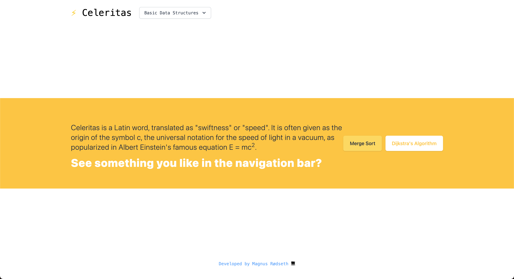

# Celeritas: Visualizing Data Structures and Algorithms ⚡️

## Live Demo 🎮

You can see a live demo of the website by clicking **[here](https://celeritas.vercel.app/)**. Enjoy!

Note that this project is currently a work in progress, as of summer 2021.

## Snapshot 📸



## Description ✏️

> Celeritas is a Latin word, translated as "swiftness" or "speed". It is often given as the origin of the symbol c, the universal notation for the speed of light in a vacuum, as popularized in Albert Einstein's famous equation E = mc².

Celeritas is a website for visualizing data structures and algorithms.

## Developer Information 🙋🏼‍♂️

Developed by Magnus Rødseth.

## Tech Stack 🛠

- [Next.js](https://nextjs.org/)
- [React](https://reactjs.org/)
- [TypeScript](https://www.typescriptlang.org/)
- [Tailwind CSS](https://tailwindcss.com/)
- [Formidable Labs Victory](https://formidable.com/open-source/victory/), for data visualization
- [Formidable Labs Spectacle](https://formidable.com/open-source/spectacle/), for live demo code

## Running the application ✅

```shell
# Navigate to celeritas folder on your computer
cd celeritas

# Run application in development mode using yarn
yarn dev

# OR

# Run application in development mode using npm
npm dev
```

Open up your browser. The application should now be running on `localhost:3000`!
